# 私人訂購頁｜限定預購網站產生器

> 展場、快閃、受邀限定販售用的預購網站。動態密碼閘門、名片驗身份自動切折扣價、訂金尾款分階段，跑在 Cloudflare + Google 上，維護成本 $0。

這是一個 Claude Skill，給 Claude Code / Claude 桌面版用。丟給它，它會問你要的東西，然後產出一整套可以部署的網站。

適用情境：價格不能外流、固定密碼會被分享出去、需要驗證專業身份才給折扣價。套版購物車做不到這些。

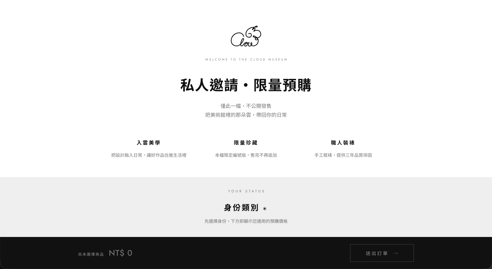

---

## 功能

**動態密碼閘門**
每 30 秒更新的 6 位數，現場人員報給客人才進得去。未通過閘門連 HTML 原始碼都拿不到——網址單獨外流沒有用。也可以整個關掉，做成公開頁。

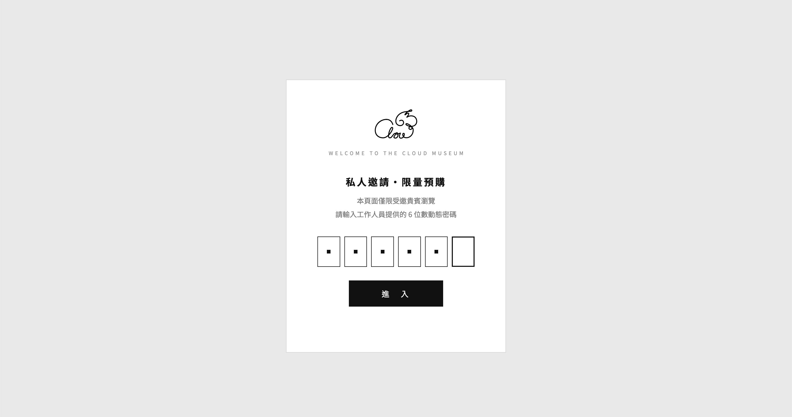

現場人員用驗證器 App 讀當下的碼，報給客人。

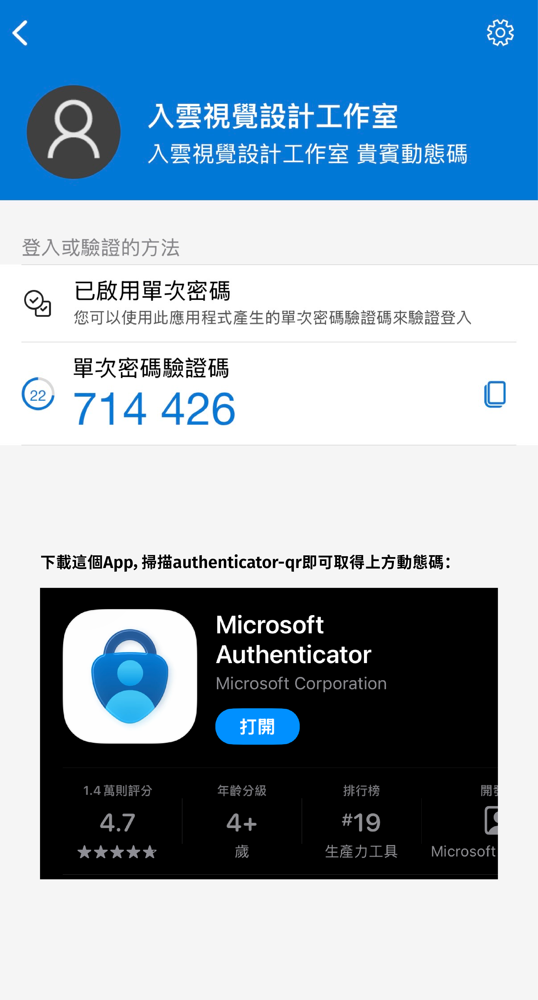

**三種商品型態**
同一份設定檔可以混放三種卡片，不必為了不同商品另外做頁面：

- **多圖輪播**——一項商品多張圖，左右滑動切換
- **分色選購**——每個顏色獨立數量、獨立定價
- **課程／體驗**——日曆選場次、每場可設名額，能自動排未來 n 個月的週末場次

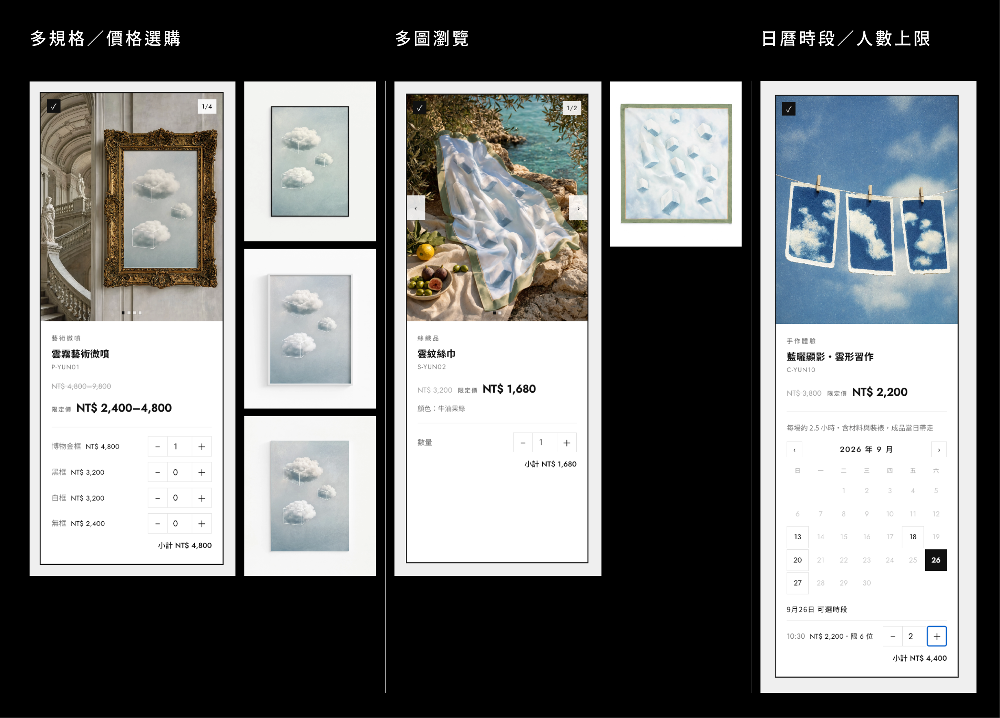

**身份折扣**
專業身份（設計師、企業採購等）上傳名片，全站價格自動切換成折扣價。

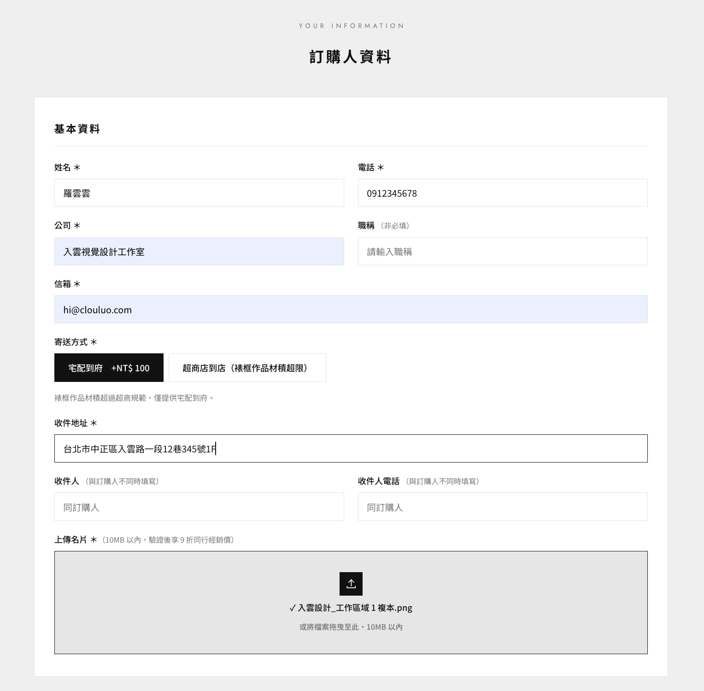

選擇專業身份後，全站價格即時換算，不必另開頁面或等人工報價。

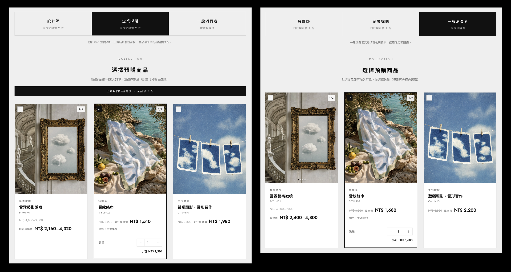

**寄送試算**
宅配／超商兩種運費，材積超限的商品自動鎖住超商選項；不需寄送的品項不問地址。超商取貨先選 7-11 或全家再填店名，宅配地址會檢查郵遞區號與門牌號碼是否齊全。

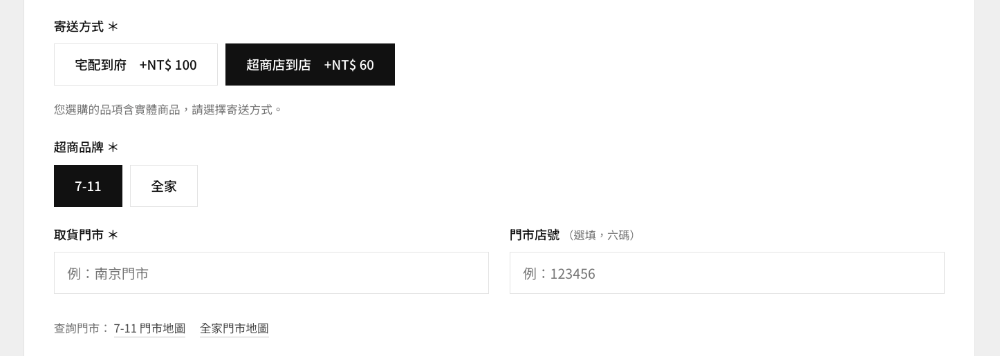

**強制閱讀條款**
捲到底才能勾同意，沒捲完按鈕是灰的。

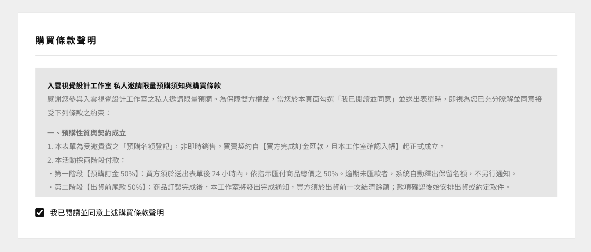

**多階段付款**
百分比自動試算，最後一段吃四捨五入尾差。可串金流連結線上刷卡。

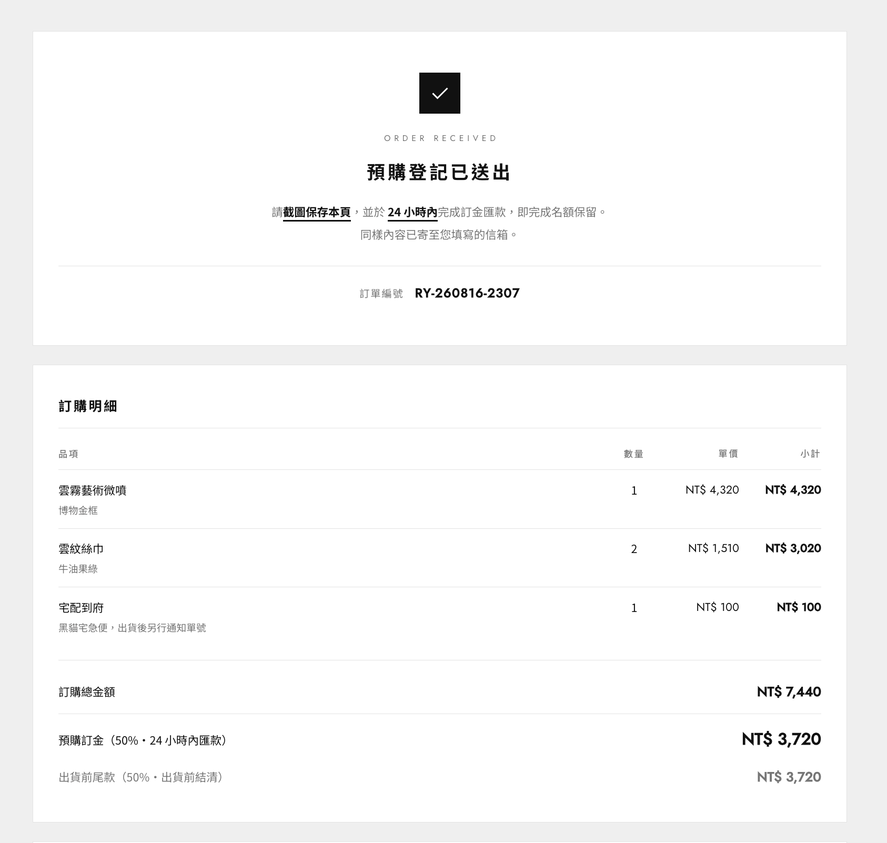

送出後導向款項回傳程序，一鍵複製匯款資訊、直接加官方 LINE。

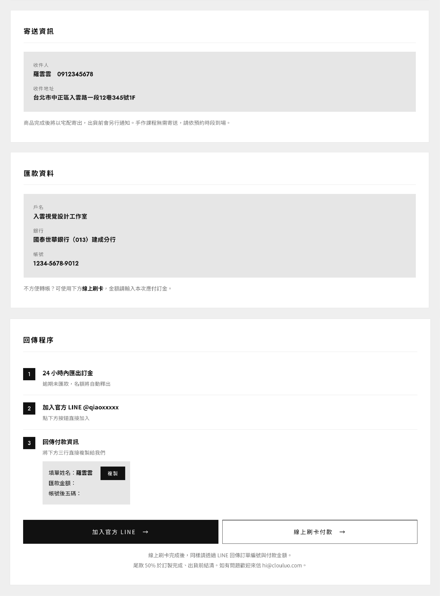

**送不出去看得出原因**
按下送出但有欄位沒填好時，一次列出全部問題並附正確範例，同時捲到第一個有問題的欄位、把該欄框線標紅。平常完全隱藏，按了才出現。

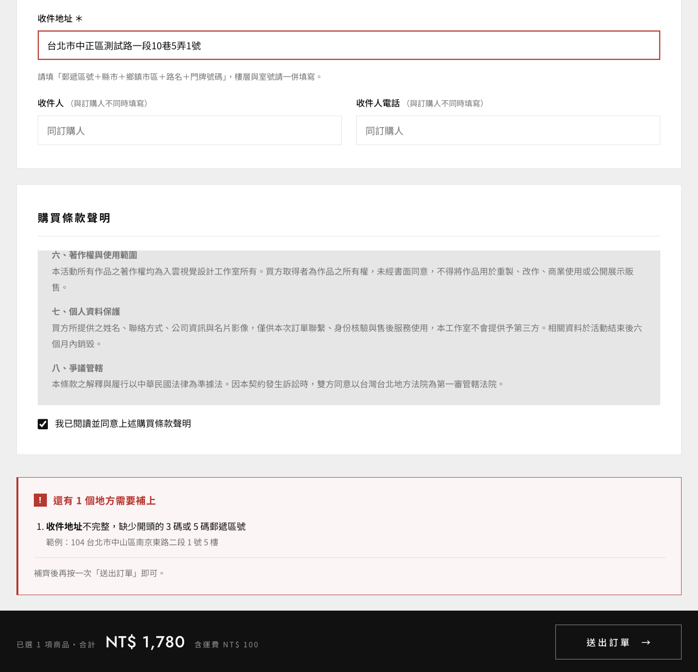

**手機也是這樣**
客人多半是現場拿手機掃 QR 進來，所以手機版不是縮小版而是重排過的：置底總計列改成兩行、按鈕縮短、底部留出 iPhone 安全區。

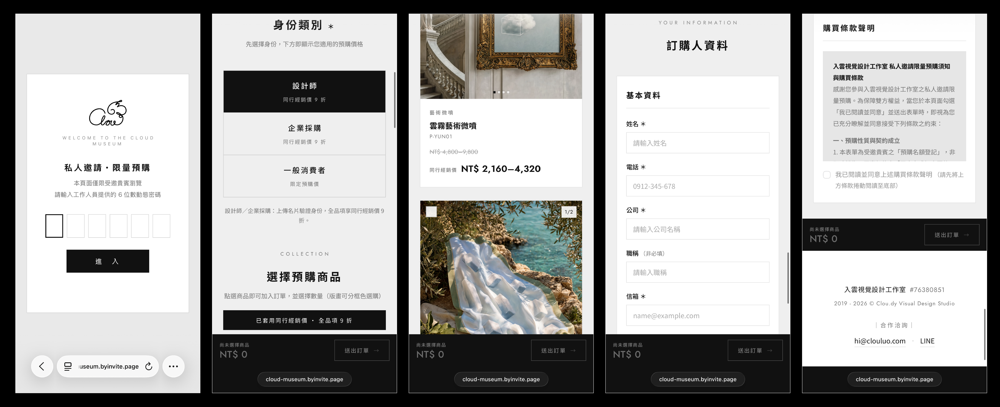

**收單雙保險**
HTML 排版通知信（公司收件＋客人副本）＋ Google 試算表訂單總表。一邊漏了另一邊還在。

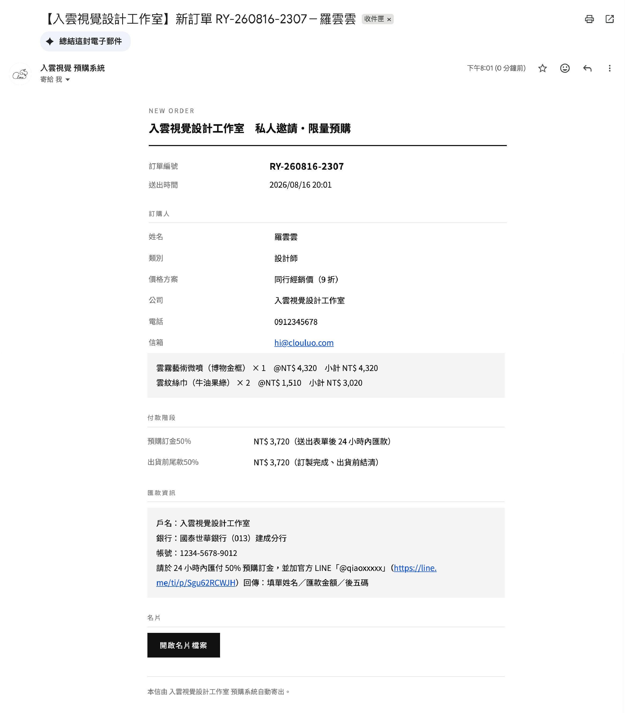

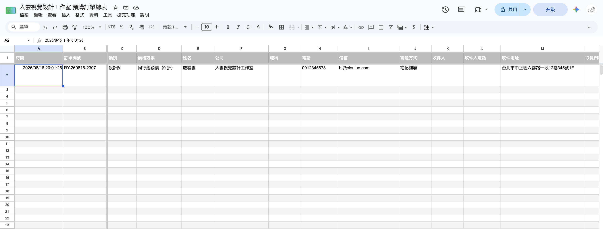

---

## 架構

```
Cloudflare Worker  →  動態密碼閘門 + 訂購頁 + 名片/圖示 KV 儲存
Google Apps Script →  寫入訂單總表 + 寄 HTML 通知信
```

只依賴 Cloudflare 和 Google，兩邊都在免費額度內。不用資料庫、不用主機、不用第三方表單服務。

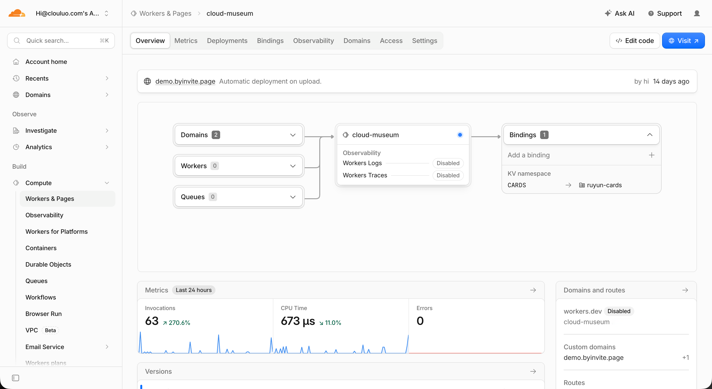

---

## 怎麼用

1. 把整個資料夾放進你的 skills 目錄
2. 跟 Claude 說「幫我做一個展場預購網站」，或任何限量／限期／受邀才能買的情境
3. 它會逐項問你要的素材（品牌、配色、商品、價格、寄送、條款、付款階段⋯⋯）
4. 產出 `site.html`、`worker.js`、`apps-script.gs`、金鑰 QR、交接說明
5. 照著部署文件推上 Cloudflare

第 4 步之後就能拿到完整檔案包，想自己部署也可以。

### 內建驗收

```bash
node scripts/check_site.js site.html          # 頁面完整性檢查
node --input-type=module --check < worker.js  # Worker 語法
```

會檢查佔位符有沒有清空、舊品牌字樣有沒有殘留、付款百分比加總是不是 100、各處金額有沒有對齊、條款鎖定機制有沒有壞。這些都是實際踩過的坑。

---

## 幾個設計上的堅持

**內容要在伺服器端保護。** 訂購頁 HTML 內嵌在 Worker 裡，未通過閘門連原始碼都拿不到。這才是「防外流」的實質保證，不是擋個 UI 而已。

**確認成功才顯示成功。** 送單要讀到後端 `ok` 才給成功頁。第三方出事時客人看到的是明確錯誤，不是假成功——訂單不會無聲消失。

**金額只算一次。** 總額＝商品＋運費，付款階段從總額拆。置底總計、成功頁、訂單信、試算表必須是同一個數字。分開算過一次，結果少收運費。

**狀態要誠實。** 沒選商品時不寫「已選 0 項，合計 NT$ 0」，那是一排沒有意義的零。改成「尚未選擇商品」，選了東西按鈕才亮起來。

**失敗要留退路。** 送單失敗先自動重試一次，仍失敗就給訂單編號、請對方別重送。叫客人再試一次，在後端其實已寫入的情況下會製造重複訂單。

**承諾與實作要對齊。** 頁面上寫的折扣、時限、運費，就是系統實際會做的事。有專業折扣就要在條款寫清楚：名片查核不符者改一般價計算並通知補差額，買方不同意可三日內取消全額退款。頁面承諾了什麼，條款就要接得住。

**會出錯的欄位要在送出前擋。** 地址少了郵遞區號或門牌號碼就是寄不到，超商只填「711台北濟新」工作人員也分不出是哪一家。這種錯誤發現時客人通常已經匯完款了。能用選的就不要讓對方自由填寫，錯誤訊息要明講缺什麼並附一個正確範例。

**送不出去要看得出為什麼。** 瀏覽器原生的驗證泡泡一次只講一個欄位，訊息還很籠統——客人按了「沒反應」就會放棄。改成按下送出時一次列出所有沒填好的地方，捲到第一個問題欄位並標紅。平常完全隱藏，按了才出現，版面不會一開始就髒。

---

## 關於作者

**羅巧雲 Clou Luo**｜入雲視覺設計工作室 負責人／創意總監

台北的平面設計工作室，做品牌識別與視覺設計。客戶專案橫跨品牌、包裝、網站與社群，同時是設計教育工作者與獎項評審。

這套系統是接案途中被客戶的難題逼出來的產物。現成方案不是沒有，但預算和時程對不上，只好自己來，最後成了一套能重複使用的工具。

- 網站：clouluo.com
- Instagram：@clouluo ／ 工作室 @clou.dy
- 合作洽詢：hi@clouluo.com

使用這套技能產出的網站與程式碼，內容與資料屬於使用者本人；歡迎自由修改與商業使用。

---

## License

MIT
